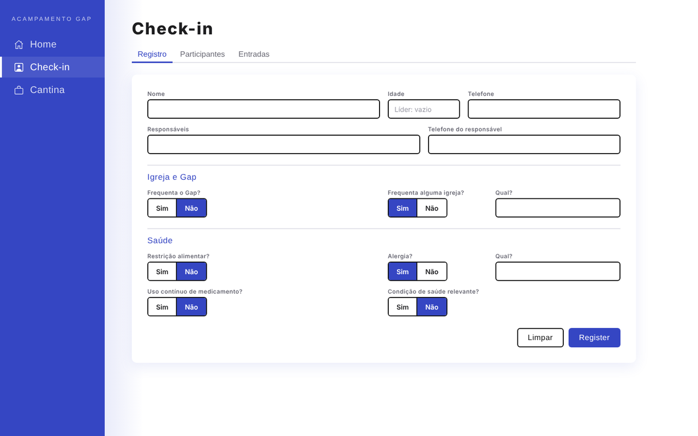
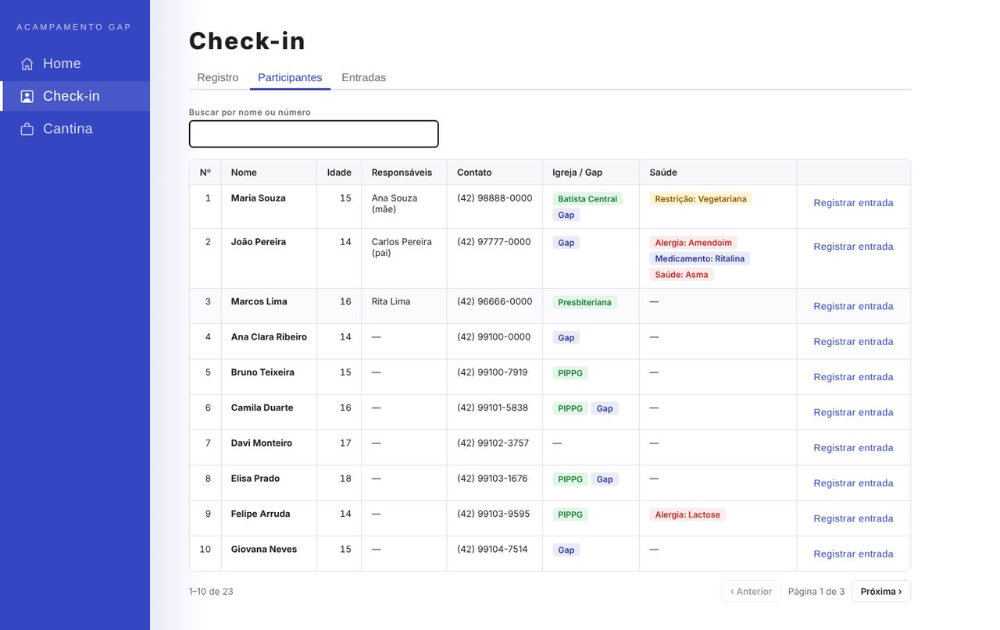
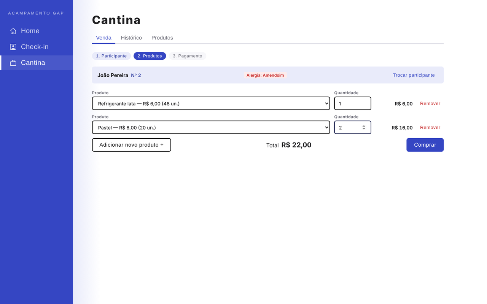
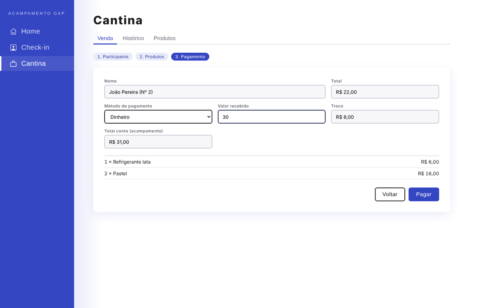
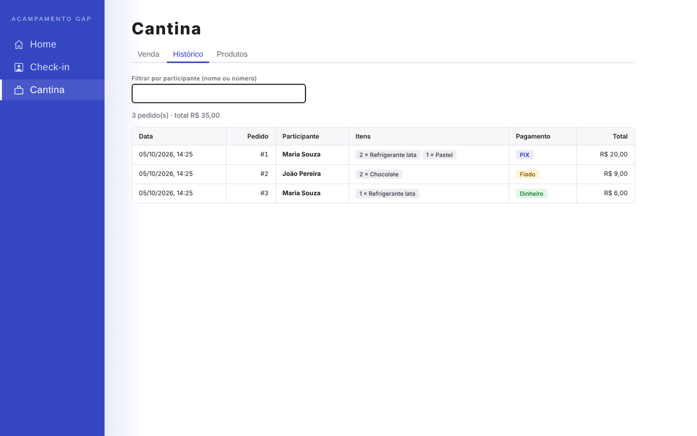
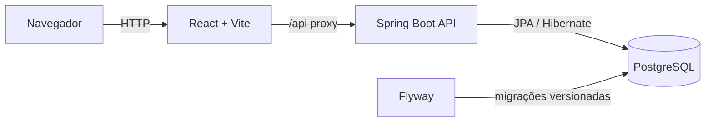
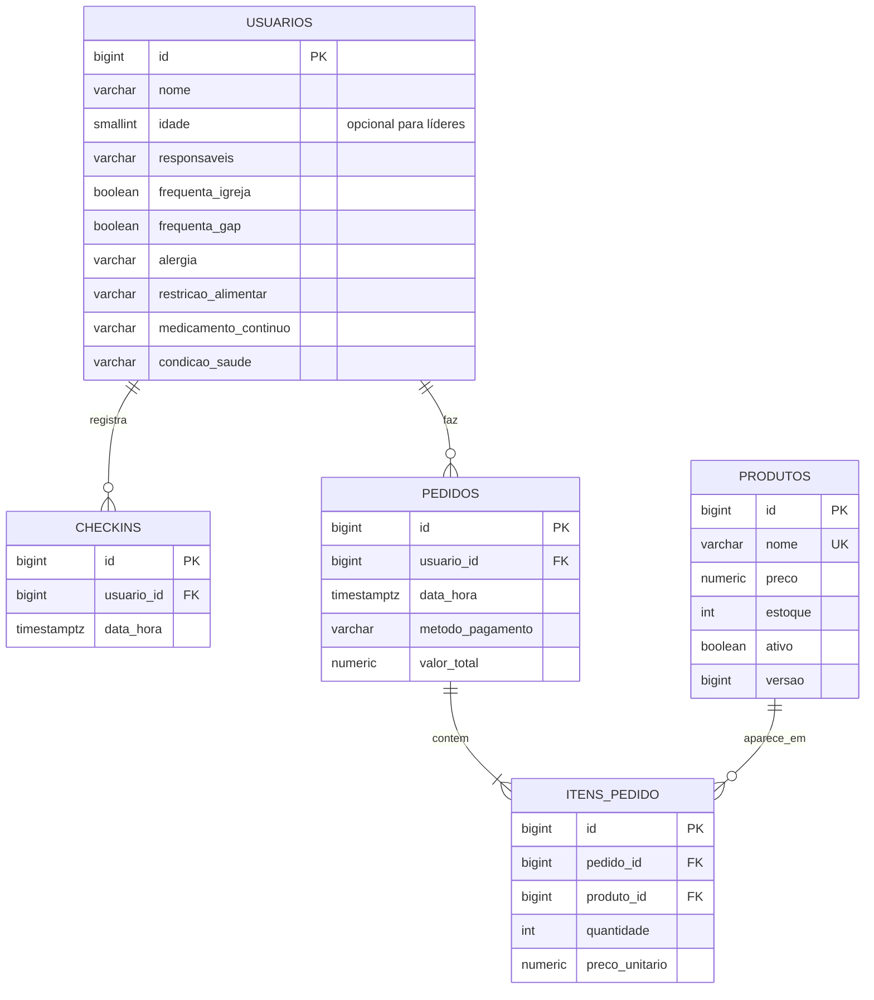

# Acampamento Gap — Check-in e Cantina

Sistema web para organizar um acampamento de jovens: cadastro dos participantes com dados de saúde, registro de entrada e uma cantina com controle de estoque e histórico completo de compras.




## O problema

Em um acampamento, as inscrições chegam por formulário, os dados de saúde ficam espalhados em planilhas e a cantina costuma ser controlada no caderno. Na hora de servir um lanche, ninguém lembra quem tem alergia; no fim do evento, ninguém sabe ao certo quanto cada participante gastou.

Este projeto concentra tudo em um só lugar:

- **Check-in** — cadastro com responsáveis, igreja, restrição alimentar, alergia, medicamentos e condições de saúde; registro de cada entrada.
- **Cantina** — venda em três etapas (participante → produtos → pagamento), com alerta de alergia na hora da compra, troco calculado e total acumulado por participante.
- **Histórico** — todas as compras com itens, forma de pagamento e valores, preservados mesmo se o preço do produto mudar depois.
- **Importação** — carga em lote das inscrições do formulário, padronizadas e sem duplicar ninguém.

## Telas

| Participantes | Cantina — produtos |
|---|---|
|  |  |
| **Cantina — pagamento** | **Histórico de compras** |
|  |  |

> As telas usam dados fictícios.

## Arquitetura



**Backend** em camadas — `web` (controllers REST) → `service` (casos de uso e transações) → `repository` (Spring Data) → `domain` (entidades com as regras de negócio). DTOs separam o contrato da API das entidades.

**Frontend** organizado por funcionalidade (`features/checkin`, `features/cantina`), com componentes de interface reutilizáveis, uma camada única de acesso à API e tokens de design centralizados em CSS.

## Modelo de dados



## Decisões técnicas

| Decisão | Motivo |
|---|---|
| **Preço congelado no item do pedido** (`preco_unitario`) | Reajustes no catálogo não alteram compras já feitas; o histórico é imutável. |
| **Lock pessimista na venda** (`SELECT … FOR UPDATE`, ordenado por id) | Duas vendas simultâneas não deixam o estoque negativo, e a ordem fixa evita deadlock. |
| **Pedido como raiz de agregado** | Itens só entram por `Pedido.adicionarItem`, que baixa estoque, congela preço e recalcula o total em um único ponto. |
| **Produtos desativados, não apagados** | Mantém a integridade referencial do histórico. |
| **Flyway + `ddl-auto: validate`** | O esquema evolui por migrações versionadas; o Hibernate apenas confere se as entidades batem com o banco. |
| **Erros no padrão RFC 9457** (`application/problem+json`) | Respostas uniformes, com mapa campo → mensagem para o formulário destacar erros. |
| **Configuração por variáveis de ambiente** | O mesmo código roda no Codespaces e na máquina local; só mudam `DB_HOST`, `DB_PASSWORD` etc. |
| **Dados pessoais fora do Git** | As inscrições contêm dados de saúde de menores; ficam em `dados-privados/`, ignorada pelo Git. |

## Como rodar

### GitHub Codespaces

Abra o repositório em um Codespace: o Dev Container sobe Java 21, Node 22 e PostgreSQL 16 automaticamente.

```bash
# terminal 1 — API em http://localhost:8080
cd backend && mvn spring-boot:run

# terminal 2 — interface em http://localhost:5173
cd frontend && npm ci && npm run dev
```

### Máquina local

Requisitos: JDK 21, Maven, Node 22 e Docker.

```bash
docker compose up -d db
cd backend && mvn spring-boot:run
cd frontend && npm ci && npm run dev
```

A senha padrão do banco é `acampamento`. Para usar outra, defina `DB_HOST`, `DB_PORT`, `DB_NAME`, `DB_USER` e `DB_PASSWORD`.

### Importar inscrições

Com a API rodando:

```bash
curl -X POST http://localhost:8080/api/usuarios/importacao \
  -H 'Content-Type: application/json' \
  --data @dados-privados/participantes-2026.json
```

A importação é idempotente: quem já está cadastrado com o mesmo nome é ignorado.

## API

| Método | Rota | Descrição |
|---|---|---|
| `GET` | `/api/usuarios?busca=` | Lista participantes por número; busca por nome ou número |
| `GET` / `PUT` | `/api/usuarios/{id}` | Consulta / atualiza participante |
| `POST` | `/api/usuarios/importacao` | Importa inscrições em lote |
| `POST` | `/api/checkins` | Cadastra participante e registra a entrada |
| `POST` | `/api/checkins/usuario/{id}` | Nova entrada de participante já cadastrado |
| `GET` | `/api/checkins` | Histórico de entradas |
| `GET` / `POST` | `/api/produtos` | Catálogo da cantina / novo produto |
| `PUT` / `DELETE` | `/api/produtos/{id}` | Atualiza / desativa produto |
| `POST` | `/api/pedidos` | Registra uma compra |
| `GET` | `/api/pedidos?usuarioId=` | Histórico de compras |

## Estrutura

```
.devcontainer/              ambiente do Codespaces
docker-compose.yml          PostgreSQL
backend/
  src/main/java/br/gap/acampamento/
    config/                 CORS
    domain/                 entidades e regras de negócio
    dto/                    contratos da API
    repository/             Spring Data JPA
    service/                casos de uso e transações
    web/                    controllers e tratamento de erros
  src/main/resources/db/migration/   migrações Flyway
frontend/src/
  api/                      cliente HTTP, endpoints e tipos
  components/               layout e componentes reutilizáveis
  features/                 home, checkin e cantina
  hooks/ utils/ styles/
```

## Próximos passos

- Testes automatizados (JUnit + Testcontainers no backend, Vitest no frontend)
- Autenticação para a equipe da cantina
- Exportação do histórico em planilha
- Deploy com Docker

## Autor

**Luiz Felipe Dias de Araujo** — [github.com/LuizFelipeDias](https://github.com/LuizFelipeDias)
